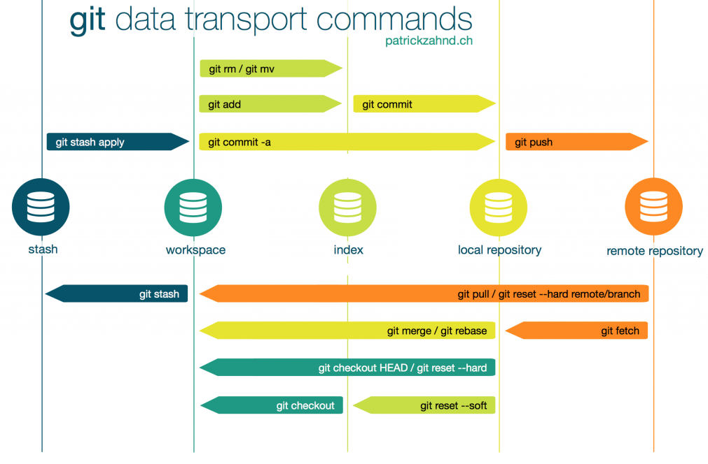

# Git

## Installation

## GUI

From Bash run `git-gui`. **Note** Does not work currently?

## Bash

Copy: ctrl + insert
Paste: shift + insert

Check local config:

```bash
pwd # current folder content
~ # home folder
    ls # items in current folder (options -a to display hidden, -l to display last update)
cat ~/.gitconfig # check local config
mkdir # create folder (option -p to create intermediate unexisting folders)
mv old new # rename. This is a delete old and create new in Git's eyes cont.
# run git add -A afterwards to make Git know it was a rename or just use git mv old new
rm #remove (options -rf to recursively force deletion of child items)
```

## SSH authentication

1. Check for existing ssh keys. Usually stored in home directory. From Bash run:

```console
ls ~/.ssh
```

You are looking for private and public key pairs named `id_rsa` (.pub is the public key). If you do not have a key pair then continue to the next step.

2. Create a new key-pair. From Bash run:

```console
ssh-keygen -o
```

Note: It is recommended to save them in the default location (continue by pressing enter).
Note: password is not neccessary
Note: -o option saves the private key in a format that is more resistant to brute-force password cracking than is the default format.

3. Use/send your public key to create a connection.

You can check your public key by running this from bash:

```console
cat ~/.ssh/id_rsa.pub
```

On Windows you can copy to clipboard by running:

```console
cat ~/.ssh/id_rsa.pub > /dev/clipboard
```

Connect to GitHub:

1.  Click on profile. Go to Settings
2.  Click SSH and GPG keys on the left navigation bar
3.  Click New SSH key
4.  Name the key (title, use something to identify the pc with the key), set type to Authentication key and paste the copied key into the Key box.
5.  Test the connection:

```console
ssh -T git@github.com
ssh -v -T git@github.com
```

## Setting up our configuration file(s)

Once the installation is completed and we have connected to GitHub we should set some settings such as your name and email. We will use the `--global` option to set our information so that it will be used in all of our local repositories.

```
git config --global user.name "FirstName LastName"
git config --global user.email "email address"
git config --global init.defaultbranch main
```

Our configuration is stored in `.gitconfig` files. There are three levels of configuration:

- system (in the Git install folder)
- global (in your home folder)
- local (in a Git repository)

We usually have 1 system and global .gitconfig and multiple local configuration files. We can see the content and location of our files by running:

```Bash
git config --list --show-origin
```

And the specific configuration can be found by specifying the level:

```
git config --list --global
```

Note that there is a hierarchy: if you have different configurations of the same thing, the one in the lowest level will be applied. So if you have specified x as your name in the global config file and y in your local repository, then y will be used as your name in that repository.

## Ignoring patterns

You can and you should define which files should not be included in your repository. Usually you do not want to include data, outputs and other unnecessary files.
This can be done by creating a .gitignore file and specifying the files or patterns to exlude, one per line.

Some examples:

```
logs/ # Ignore everything in the logs folder
*.ext # Ignore all .ext files
```

You can also set system wide ignore patterns that will be applied to all local repositories:

```bash
git config core.excludesfile [file]
```

## Creating aliases

We can create aliases for Git commands. This allows us to simplify complex commands into a single word.
We add aliases to the global configuration file:

```
git config --global alias.hist "git command"
```

We can create a new alias to show the commit history of the current branch right away. We will explore it later.
`git config --global alias.hist "log --oneline --graph --decorate --all"`

## Creating a repository

We can either initialize a Git repository in an existing directory by moving into the directory and running

```bash
git init
```

After initializing the local repository we can connect it to a remote repository (usually aliased `origin`) with:

```bash
git remote add [alias] [url]
```

We can then check the remote location of the repository:

```
git remote get-url [alias]
```

Or we can retrieve an existing repository from a remote location (e.g. GitHub) by cloning it:

```bash
git clone [url]
```

We can then connect our local repository with the previously setup GitHub repository.

## How the repository works

When a new file is created in a (sub)directory of a git repository, the status of the file is 'untracked', meaning it exists in the foler but it's not tracked by Git.
We can track (and stage) the file by running

```
git add [file]
```

Now Git has started tracking the file in this working directory and also staged/indexed the file.
We can see the list of the tracked files with

```
git ls-files
```

The file is still not included in the local repository. We first have to commit the file:

```
git commit -m "message with information about commit"
```

The file is now also stored in the local git repository. This means that there are essentially two copies of the file. If we make some changes to the file then the file in the git repository remains unchanged until we again stage the file with `git add [file]` and commit `git commit -m "second commit"`. This means that the file can be in different states. For tracked files we can shorten this process by running a single command:

```
git commit -am "all in one"
```

We could have skipped the `-m` option in both of the two cases. In that case the default Git editor would open for you to write a message about changes.

We usually have remote repository, which can hold yet another state of the directory.
We send a copy of the local repository (aliased as main) to the remote repository (aliased as origin) by running

```
git push origin main
```

While not recommended, we can push untracked file by passing the `-u` option.

We can check the status of the repository with

```
git status
```

## Adding files to the repository

I will show how to make changes by example. Let's first create a README file, which is a standard piece of a Git repository. You can create it manually or running

```
echo "# Testing Git" >> README.md
```

If we then check the status with `git status`, we see that the file is shown in the Untracked files section.
It is part of the working directory but not part of the Git repository (or even tracked by Git).

We can start tracking (by adding it to the index) the file with the following command:

```
git add README.md
```

The add command updates the index using the current content found in the working tree, to prepare the content staged for the next commit.
Important notes:

- we also use the same add command after making any changes to the working tree, before running the commit command. This will add the modified files to the index.
- add can be performed multiple times before a commit. It only adds the content of the specified file(s) at the time the add command is run; if you want subsequent changes included in the next commit, then you must run git add again to add the new content to the index.
- we can also add files that follow a pattern we have set to ignore in the .gitignore file. We do so with `git add -f [file]`.

Checking the status shows that there are new ready to commit changed in the working directory. The README.md file is now tracked and staged.

If we wanted to unstage the file prior to commiting we can do so with

```
git restore --staged README.md
```

We will continue and commit the changes to the git repository:

```
git commit -m "Message about commit"
```

The README.md file is now part of our local git repository.

If we wish to remove a file only from the git repository we can do so with

```
git rm --cached README.md
```

If we instead want to remove the file altogether we replace the --cached option with -f.

### HEAD

From [StackOverflow](https://stackoverflow.com/questions/2304087/what-is-head-in-git):

> A head is simply a reference to a commit object. Each head has a name (branch name or tag name, etc). By default, there is a head in every repository called master.
> A repository can contain any number of heads. At any given time, one head is selected as the “current head.” This head is aliased to HEAD, always in capitals".

Note this difference: a “head” (lowercase) refers to any one of the named heads in the repository; “HEAD” (uppercase) refers exclusively to the currently active head. This distinction is used frequently in Git documentation.

The usual case is that the HEAD follows you and depends on the current branch. You can see the current HEAD with `cat .git/HEAD`.
To see your current head you can also use the `git hist` alias we have defined. Try creating another branch and checking the command there. Then commit some new changes to the new branch and check the command again. Switch back to main and check the command there as well. Notice that the HEAD is actually following you, it does not point to a fixed commit.

Note: If the result of that shows a SHA-1 checksum it is considered that the HEAD is detached and does not follow you (the current branch). We can force a detached HEAD with `git checkout --detach`. If we make new commits on this branch and check the hist command we will see that the HEAD is now ahead of main. The head will be "reattached" to the branch that we will checkout to.

Examples:

```
git diff commit HEAD # differences between commited files HEAD could be replaced with the HEAD commit id
```

## Git tags - tagging commits

[Git tags](https://git-scm.com/book/en/v2/Git-Basics-Tagging)
You can mark important commits such as releases of new versions by tagging them.

List all the tags (in alphabetical order) in the repository with `git tag`.
List only specific tags by running `git tag -l "*wildcard*"`. (`-l` is the list option)

Say the last commit marks the second version of the product. You can tag the commit with `git tag -a v2 -m "new release"`.
The `-a` option specifies that the tag is an annotated tag, which is a more detailed tag that contains information about the tagger,
date and have a message that is passed with the later `-m` option. Forgetting to pass the later will open the default editor for you to pass a message.
Without specifying `-a` the tag is considered a lightweight tag without any other information.

If you forgot to tag a commit in the past you can still add a tag to the specified commit by passing the commit checksum.
`git tag -a v1.2 [checksum] -m "message"`.

### Checking tags

You can check information about specific tags along with the changes the commit introduced with `git show [tag]`.
You will notice that for `lightweight` tags there will be no extra information about the tag displayed.

### Sharing tags in the remote repository

By default, the git `git push` will not transfer tags to remote servers.
To do so you will have to explicitly push the desired tag by passing the tag name `git push origin [tag]`.
Passing multiple tags at once is done by providing the `--tags` option to the push command.
On GitHub it is now more straightforward to open the repository at a certain commit by selecting the desired tag.

### Deleting tags

Deleting tags from the local repository is simple and is done by passing the `git tag` command the `-d` option before the tag name we wish to delete: `git tag -d [tag]`.

Note that you will also have to explicitly delete the tag from the remote repository with `git push origin --delete [tag]`.

## Moving forward - Making, inspecting, applying changes

It is important to note that the "same" file can be saved in different states at the same time. In fact there can be up to 4 "copies" or states of the same file:

- in the working directory
- in the staging area
- in the local repository
- in the remote repository

Changes done in the working directory are not automatically applied to the other versions of the file. We have to follow the same procedure as we have for adding a new file to the repository.



### Git Index / Staging area

As the Git book states:

> The staging area is a file, generally contained in your Git directory, that stores information about
> what will go into your next commit. Its technical name in Git parlance is the “index”, but the phrase
> “staging area” works just as well.

Putting it another way:
The "index" holds a snapshot of the content of the working tree, and it is this snapshot that is taken as the contents of the next commit.

[Check out this thread on SO for a more in depth look in the index.](https://stackoverflow.com/questions/4084921/what-does-the-git-index-contain-exactly)

### Inspecting and comparing changes

We have already created an alias (a shortcut) to see the history of the repository. We have used the `log` command, which in it's basic form returns the history of the repository in reverse chronological order. For each commit we see the SHA-1 checksum, the author, date and message.
To navigate down the output press ENTER. The end of the output will show END in the command line. You can press `q` to exit the log interface at any point.

The history usually is not enough. We also want to see the changes that were introduced with each commit.
This is usually done with `git diff`. There are multiple uses of the diff command which we will mention briefly in the following subsections.

History can be also seen with the log command, if the add the -p option,
which will show the history and the changes for all commits or just for a selected number of commits by adding -[number], as shown below:

```
git log -p -1 # (-p or --patch)
```

Another useful use case is to see the history of a specified file. The history of commits pertaining (that introduced changes) to a certain file can be seen with:

```
git log [file]  # add -p before [file] to also show the differences
```

Note that if we have at any point changed the name of the file, we will not see the commits for changes with the previous name.
We can however add the `--follow` option, which will show the commits that changed the file even across renames.

There are many other options that can be passed to the command, for example:

- we can limit the timeframe of the history by adding --since=2days.ago, --before=[date], --after=[date],...
- we can show just the statistics of the changes to the file with --stat (how many additions, deletions,...)
- we can show just the statistics of the changes of a specific branch: `git log [branch]`.

Further options can be explored in [commit history](https://git-scm.com/book/en/v2/Git-Basics-Viewing-the-Commit-History).

#### Differences between two commits

```
git diff commit1 commit2
```

where commit1 and commit2 are SHA-1 checksums or abbreviated SHA (as printed with our alias). If there are differnces between these two commits, the command returns what's new in commit2 (+, in green) and what is removed with commit2 (-, in red).

#### Differences between working directory and the index/staging area

We can see the differences by runing `git diff` without passing any other arguments.
For each file with changes, this command will output the differences between the local file and the file stored in the index.
We can focus on a single file by adding the file name: `git diff [file]`.
Note that this will not show differences between staged files and files in the index.

#### Differences between the staged area and the local repository

[How to Show the Changes which Have Been Staged in Git](https://www.w3docs.com/snippets/git/how-to-show-the-changes-which-have-been-staged.html)

We can compare differences between the staged file(s) and the files in the local repository by passing the `--cached` (`--staged` also works) option to the `diff` command.
We can also pass the `--verbose` (or `-v` for short) option to the `status` command in order to see the status and the staged changes in the same output.

#### Differences between the working directory and the local repository

The differences can be analyzed with the `git diff HEAD` command.

#### Differences between branches

The `diff` command is also used to compare branches, which we will explore in the branching section.

### Reference logs

> Reference logs, or [reflogs](https://git-scm.com/docs/git-reflog), record when the tips of branches and other references were updated in the local repository. Reflogs are useful in various Git commands, to specify the old value of a reference. For example, HEAD@{2} means "where HEAD used to be two moves ago", master@{one.week.ago} means "where master used to point to one week ago in this local repository", and so on.

**Important note:** In some shells (like PowerShell) the command `git diff HEAD@{2}` does not work. In such cases you can try the following options: 'HEAD@{2}', HEAD@'{2}' and HEAD~2.

Reflogs have many uses cases: git checkout, git reset, and git merge are examples of some common git commands that accept references as parameters.

So far I have been referring to specific comits using indices (1,2,...). We can, however, leverage other information stored in reflog entries in order to select (point to) specific commits. For example each reflog entry has a timestamp attached to it. It is therefore possible to filter the reflog entries by time. Commonly used time qualifiers are:

@{0}
@{X.minutes.ago}
@{X.hour(s).ago}
@{X.day(s).ago}
@{X.weeks.ago}
@{X.years.ago}
@{today}
@{2023-09-16 01:01:01}
@{1.day.23.hours.ago}

From the last example we can see that the time qualifiers can be combined. Both plural and singular forms of these time qualifiers are accepted (e.g. 1.minute.ago, 2.minutes.ago). They can also be combined with a specific branch `my_branch` (e.g. `git reflog show my_branch@{3.days.ago}`).

The command `git reflog` has three main subcommands "show", "expire" and "delete". Here I will mainly focus on the "show" subcommand, which is also used as default when typing just `git reflog`. `git reflog show` is an alias for git log -g --abbrev-commit --pretty=oneline. This will show the reference log for the HEAD of the current branch by default. Reflogs for a certain branch are retrieved with `git reflog show [branch]`. Adding the `-all` option includes the reflogs for all references.

### Postponing changes

Check [git stash](https://git-scm.com/docs/git-stash)

The idea of this section will again be presented by example:
Suppose you get an urgent task in a project whilst already doing some work in the same project.
You have already made changes (possibly also staged/indexed some of them) to the files but are not yet finished and have not done any testing.
You can easily clean the dirty working directory and save/record the current state of the working directory and the index with

```
git stash # same as git stash push
```

Notes:

- You can also stash only certain files by listing them after the command or even the whole folder (`git stash push folder/*`). Note that in this case you will have to add the push option.
- Untracked files can be stashed away by adding the `--include-untracked` option.
- You can stash only staged files by adding the `--staged` option.

To reiterate: this will save your modifications and revert the working directory to the HEAD.

You can see the stashed modifications with `git stash list` and inspect the changes with `git stash show`.
The changes are restored to the (possibly modified) working directory with `git stash apply`. Doing this will not remove the stashed changes (check `git stash list`).
This is instead done with `git stash drop`. Note that there is a shortcut with `git stash pop`.
This brings us to the next thing we have to note. We can do multiple stashes and they are stacked on top of each other.
You can see that by listing the stashes. The last stash will be indexed as 0. You can inspect specific stashes by adding the numbered refernce as an option.
To inspect the previous stash you can run `git stash show 1`. Replace with 0 to see the last stash, which is also the one shown by default.

This means the last stashed changes will be the first to be restored with the `pop` option.
You can however pop a stash of your choosing by adding the refernce to the stash. `git stash pop 1` to apply and drop the previous stash whilst preserving the last stash in the stashed area.

Use cases:

- interrupted workflow (stash changes, do the urgent task, pop the changes back in);
- unable to pull remote due to conflicting changes (stash conflicts, pull, pop back in);
- save unrelated changes for future use (stage changes and stash staged);
- testing partial commits (check the link).

### Making changes

Example:
Suppose we make some changes to the README.md file, a copy of which is now in the working directory, the local repository and the remote repository.

If we then run `git status` we can see that Git noticed the changes and marks the file as modified. It is now in the unstaged area.
We can then stage the file with the `git add README.md` command (changes are now ready to be committed).
And then we commit the changes to the local repository. We are now ahead of origin/main.

#### Partial commits

[Partial commits on SO](https://stackoverflow.com/questions/1085162/commit-only-part-of-a-files-changes-in-git)

This option is helpful in the event we have made many changes that should be really part of different commits.
This lessens the burdens of possible bugs that might occur in the changes.

We can make partial commits of a file by simply adding the `--patch` (`-p`) option to the `add` command, aswell as specifying the file name:

```
git add -p file_name
```

This will open a step-by-step prompt that will iterate over pieces (so called _hunks_) of code. The prompt will ask us to select one of multiple options about
what to do with the current hunk. These options differ by hunks and you can see the available options for the current hunk in the array prompt.
The descriptions are shown by pressing `?`:

```
y - stage this hunk
n - do not stage this hunk
q - quit; do not stage this hunk or any of the remaining ones
a - stage this hunk and all later hunks in the file
d - do not stage this hunk or any of the later hunks in the file
j - leave this hunk undecided, see next undecided hunk
J - leave this hunk undecided, see next hunk
g - select a hunk to go to
/ - search for a hunk matching the given regex
e - manually edit the current hunk
? - print help
```

After going over all the hunks you should check you have staged the correct changes with `git diff --staged`.
Another helpful command is `git reset -p` which can unstage mistakenly added hunks.

### Modify the most recent commit

We can add changes (amend) the previous commit by staging the new changes and using:

```
git commit --amend --no-edit
```

This will not create a new commit and will instead modify the previous one. The `no-edit` option is added to keep the current commit message.

### Combining multiple commits into a single commit (squashing)

While developing new features it is recommended to frequently test and commit changes. Many of such commits might be unnecessary after the development is done and might be better combined into a single commit in order to keep the repository cleaner.

We can do so with a technique usually called "squashing". There is no direct `git squash` command and there are multiple ways to perform it.

#### Rebasing as a single commit

The first option is to use rebasing. We will interactively (specified with the `-i` option) rebase the repository by a certain number of commits **N**.

```
git rebase -i HEAD~N
```

The default git editor will open and will display the commits with **pick** at the start. To squash all commits into a single (the first) commit we have to change **pick** to **squash** in every line but the first. We are then asked for the commit message with the combined commit messages as default.

#### Merging as a single commit

Another option is to merge all commits in the feature branch as a single commit. We can do so with

```
git merge <branch> --squash
```

Note that this will add all the changes to the staged area instead of creating an automatic commit (as is the case with the normal fast-forward merge). You can then commit the changes as usual. The one by one commits may still kept in the feature branch.

### Merging

[Git merge](https://git-scm.com/docs/git-merge)

Git merge incorporates changes from another named commit into the current branch. It joins two development histories together.

For example when adding a new feature we would create a new feature branch to develop the new feature.
The commits on the new branch after its creation will differ from the commits on the main branch.
There will be different development histories from this point forward. After finishing and testing the new feature,
we have to incorporate the changes we've made on the feature branch to the main branch.

This is done with the `git merge [feature]` command (while being in the original branch),
which will replay the changes (all commits) made on `[feature]` since it diverged from the branch.
It is advised that you have no uncommited changes when using the merge command as it may result in conflicts and possibly the need
to abort the merge which may not be able to completely restore the state of uncommitted changes.
This may result as a new commit on the original branch, depending on the merge type (no commit for fast-forward).

Fast-Forward merge is a soft merge that will happen when current branch head is an ancestor of the named commit and there are no conflicts.
In such cases the history of both streams is the same and does not have to be stored in a new merge commit.

You can abort the merge with `git merge --abort`.

#### Conflicts

The merging can result in conflicts, which basically means that there are conflicting changes done in both branches and Git
can not decide which to use. This can happen if the same hunk has different changes in the two branches.

You will have to resolve the conflicts. The conflicting parts will be marked in the file with (<<<< changes on main ===== changes on feature >>>>).
Leave the part you want to keep and delete the rest. You can also keep both (just add the feature on the line below).
Then run `git add [file with resolved conflicts]`. And finally commit with a message to conclude merge.

### Collaborating

If there are other persons working with the repository you should first check if there are any changes commited by other members of the team:

```bash
git pull # automatically merges and automatically merges the commits of the remote branch
git fetch origin # fetches the branches from the remote repo in the local repo. Does not affect prior stages.
```

Example git fetch:
Go to the remote repository, make some changes in a file and then commit the changes directly to the main branch.
If we straight away check the status of the main branch we won't notice any changes.  
In fact we have to fetch the remote repository first. Checking the status reveals that we are actually behind the remote branch by one commit.
Depending on the changes we might be able to do a fast-forward merge/pull or we might have to resolve conflicting changes (this will be discussed later).
What is important is that the changes are not yet applied to your local file. If we wanted them to be applied we can then merge the fetched changes with the working directory:

```
git merge
```

We have now updated our working directory with the remote changes.

Example git pull:
Do some other non-conflicting changes in the remote repository.
By running `git pull` we will immediately merge the remote repository with our workspace.

After adjusting for the differences (merging the remote and working directory) we can push our changes to the remote with `git push origin main`.

## merge or rebase? TO DO

[Article](https://www.simplilearn.com/git-rebase-vs-merge-article#:~:text=Merge%20lets%20you%20merge%20different,Rebase%20logs%20are%20linear.)

### Larger changes

### Branching - TO DO

## Reverting the status Moving Backwards

In the previous section we went forward with new changes. We can also revert changes and restore the file to a previous version.

https://git-scm.com/book/en/v2/Git-Basics-Undoing-Things

### Using tags

There are two useful commands that allow us to go back in time to a tagged commit.
Let's say in some point in time we released the first major update and tagged it with `git tag -a v2.0 -m "Second version"`.
At some later point, after having made new minor releases, we realize that they started turning the project in a wrong direction.

1. We can create a new branch that will continue from the tagged commit with `git checkout -b [branchName] [tag]`.
2. We can revert/reset the main branch using the `git reset --hard [tag]` command.

## Git Blame

[Docs](https://git-scm.com/docs/git-blame) or `git blame -h`.

Show what revision and author last modified each line of a file.

```
git blame [file]
```

Useful options:

- Specify line range with -L: `git blame -L 1,20 [file]` will only show information for the first 20 lines of the file. It is also possible to define the start and end locations using regex expressions.

- Specify time range with --since: `git blame --since=2.weeks -- [file]` will prepend lines that were last changed more that two weeks ago with **^**.
  In PowerShell you can filter changes that were made in the last two weeks with: `git blame --since=2.weeks -- [file] | select-string '^(?!\^).*' `.
